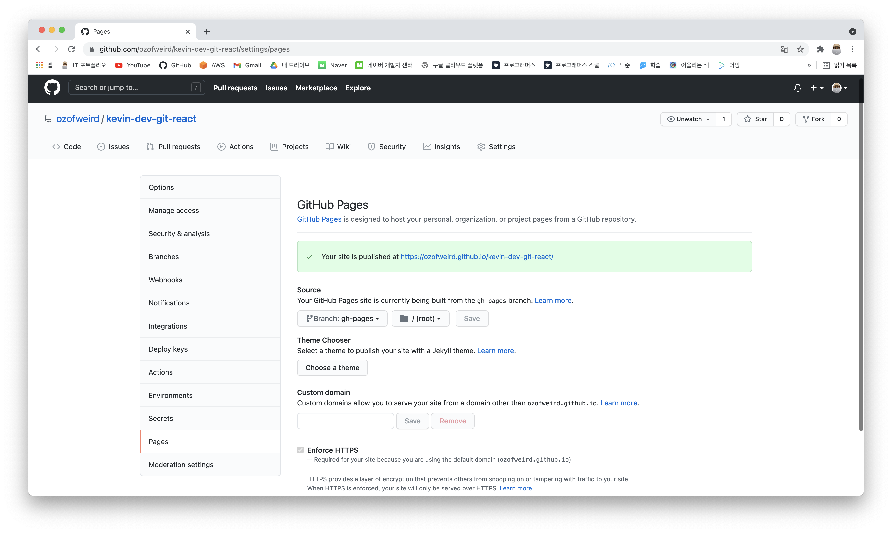

# kevin-dev-git-react

---

## 프로젝트 설명

React를 이용하여 간단한 Github 페이지를 생성하는 프로젝트입니다.

---

## 사용법

> React

```shell script
npm install -g create-react-app
create-react-app kevin-dev-git-react
npm install --save-dev gh-pages
```

> package.json

```json
{
  "homepage": "https://ozofweird.github.io/kevin-dev-git-react",
  "name": "kevin-dev-git-react",

  //...생략

  "scripts": {

  //...생략

    "predeploy": "npm run build",
    "deploy": "gh-pages -d build"
  },
  //...생략
```

> Git

```shell script
git init
git add .
git commit -m ":tada: 초기화"
git remote add origin https://github.com/ozofweird/kevin-dev-git-react.git
git push origin master
npm run deploy
```

---

## 결과

- https://ozofweird.github.io/kevin-dev-git-react



---

## 참고

- [React JS를 Github Pages에 호스팅하기](https://www.hohyeonmoon.com/blog/react-js-github-pages-deploy/)